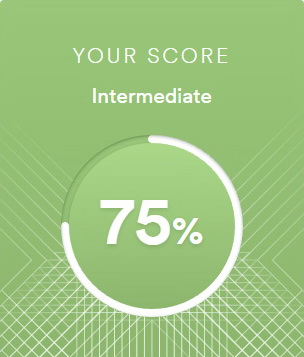

## Nastassia Pisanko

## My contacts
* Location: Minsk, Belarus
* Phone: +375299445115
* E-mail: bonjozzy@gmail.com
* Telegram: @Nana_Pisanko
* GitHub: iamarrow88
* Discord: Nana88#3563

## About Myself
Hello, I'm Nana. I like to be a part of RS shool community. I'm learning html, css and java script for a couple of months and I'm feeling interested and excited. I can spend all day long  make up a website or doing exercises on codrwars. But usually I stop myself and divide my time between my job, my family and my education.
I hope that this opportunity will change my life so I'm doing my best. 
## Skills 
* HTML5, CSS3
* JavaScript Basics
* Git, GitHub

## Code examples
My solution of KATA from CODEWARS: Create a function that takes an integer as an argument and returns "Even" for even numbers or "Odd" for odd numbers.
```
function even_or_odd(number) {
  if (number % 2 === 0) {
    return 'Even';
  } else {
    return 'Odd';
  }
}
```

## Courses
* www.codecademy.com/ - HTML, CSS
* Udemy:
   - [WEB-разработчик](https://www.udemy.com/course/webdeveloper/) (in progress)
   - [Полный курс по JavaScript + React](https://www.udemy.com/course/javascript_full/) (in progress)
* JavaScript on learnjavascript.ru (in progress)
* JavaScript/Front-end by [RS School](https://rs.school/) (in progress)

## Education
Belarusian State Technological University - did not graduate from

## Languages
* Russian - Native
* English -  B1/Intermediate (according to the online test at www.efset.org)\

